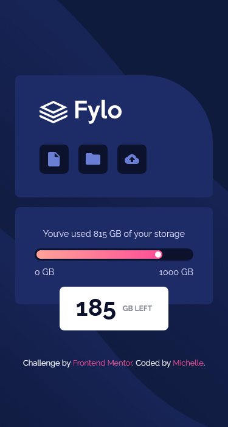
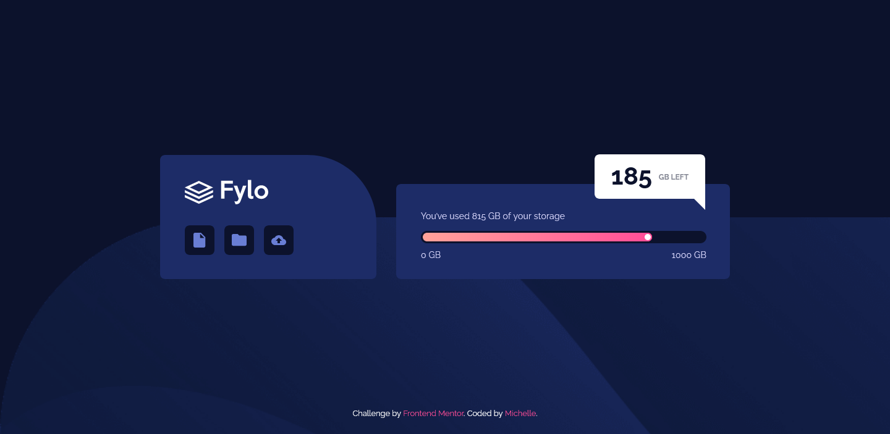

# Frontend Mentor - Fylo data storage component solution

This is a solution to the [Fylo data storage component challenge on Frontend Mentor](https://www.frontendmentor.io/challenges/fylo-data-storage-component-1dZPRbV5n). Frontend Mentor challenges help you improve your coding skills by building realistic projects.

## Table of contents

- [Overview](#overview)
  - [The challenge](#the-challenge)
  - [Screenshot](#screenshot)
  - [Links](#links)
- [My process](#my-process)
  - [Built with](#built-with)
  - [Continued development](#continued-development)
- [Author](#author)
- [Acknowledgments](#acknowledgments)

## Overview

### The challenge

Users should be able to:

- View the optimal layout for the site depending on their device's screen size

### Screenshot

### Links

- Solution URL: [click here](https://github.com/mcdulingm/FYLO-Data-Storage-Component)
- Live Site URL: [click here](https://mcdulingm.github.io/FYLO-Data-Storage-Component/)

## My process

I set up the different styles from the style guide provided. I then inspect the sizes each each element to know what my boundries are. I took a mobile first approach.

### Built with

- Semantic HTML5 markup
- SASS/SCSS
- Flexbox
- Mobile-first workflow

### Continued development

I'm going to continue focusing on improving my SASS/SCSS. There are still a lot of tricks I need to learn before using it in bigger projects.

## Author

- Frontend Mentor - [@mcdulingm](https://www.frontendmentor.io/profile/mcdulingm)

## Acknowledgments

Shout out to the future mentors in my life who will be helping me grow and improve my skills.
